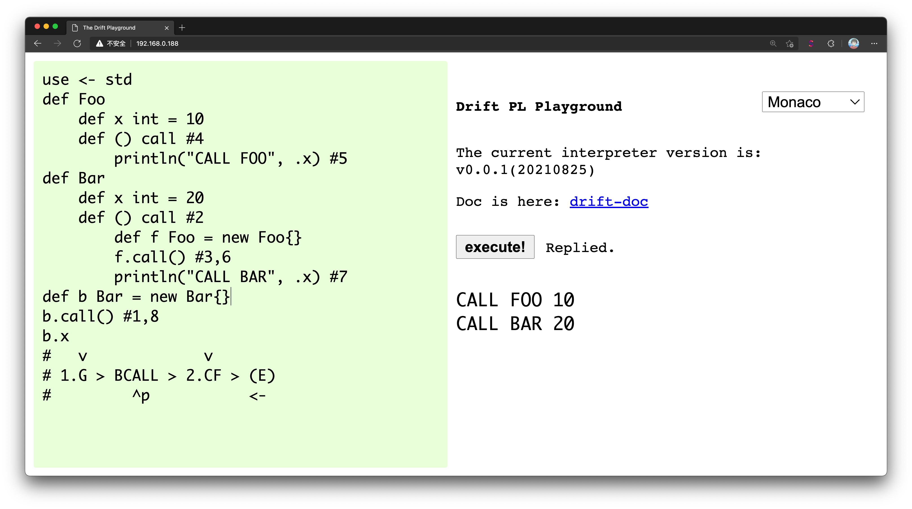

# The Drift Playground

Use the Go language to write Websocket services to provide an online operating environment for Drift.

### Build

Make sure to install the Go language, clone project, execute this command in the directory.

```shell
> go mod download
> go mod verify

> go run main.go
```

Make sure your system has drift installed and you can use the drift command.

The port can be modified in the **main.go** file to ensure that the connection port in the **index.html** file is consistent.



### License
```
GPL v3.0 license to bingxio@qq.com
```